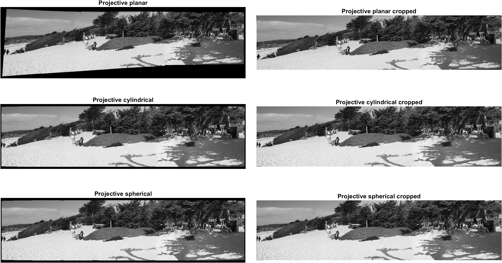
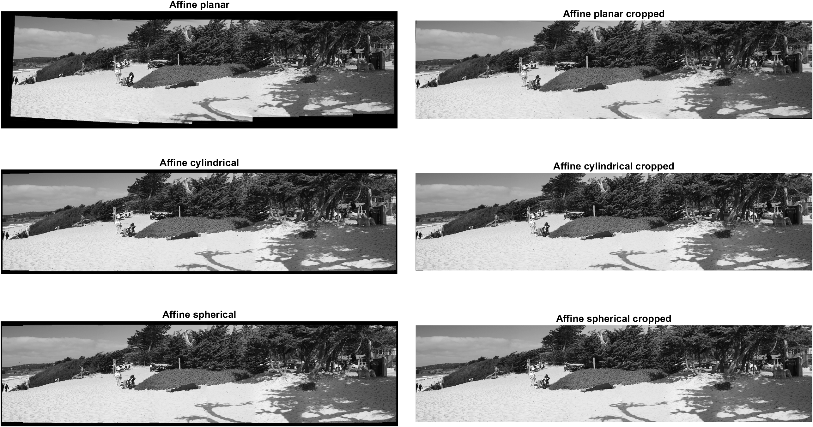
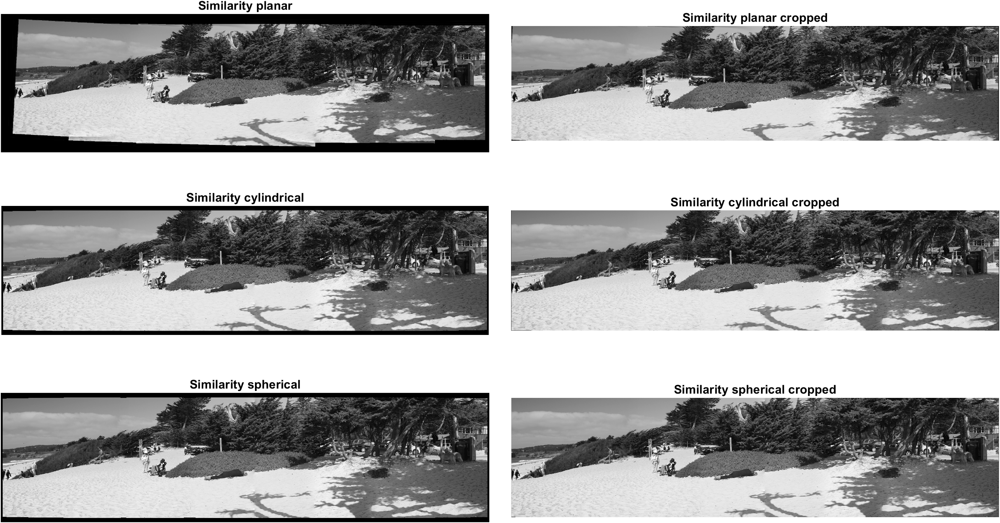
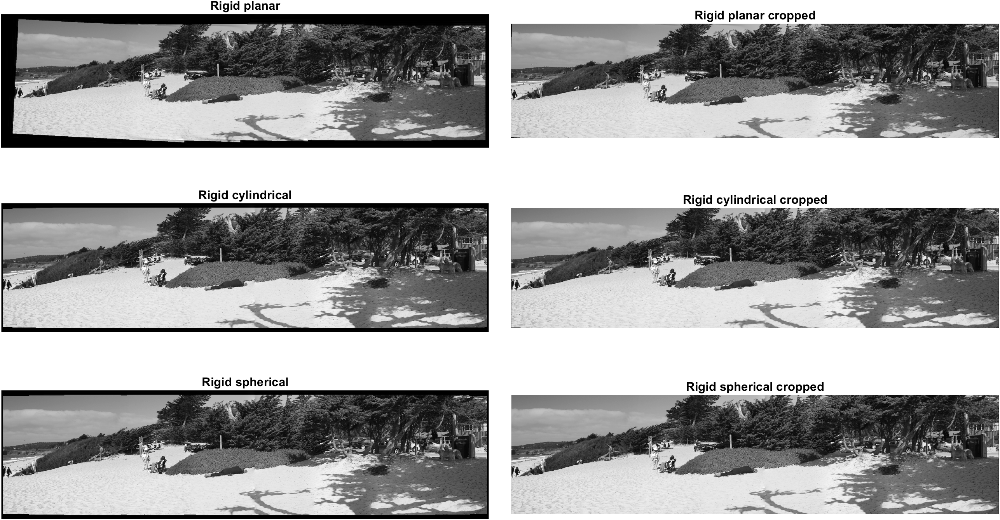
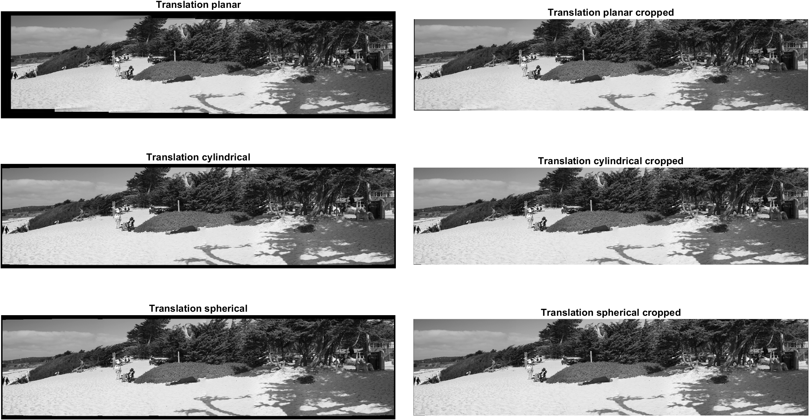

# Automatic cylindrical, spherical and planar panorama stitching given the Rotation (*R*) and Camera Intrinsics (*K*) matrices
[](https://www.mathworks.com/matlabcentral/fileexchange/178979-image-stitching-cylindrical-spherical-planar-given-r-and-k) [](https://matlab.mathworks.com/open/github/v1?repo=preethamam/Image-Stitcher-RK-Matrices-Cylindrical-Spherical-Planar)

Automatic cylindrical, spherical and planar panorama stitching of multiple images given the rotation (*R*) and camera intrinsics (*K*) matrices after the bundle adjustment procedure. If the reference image's rotation (R) matrix is represented by an identity matrix, this program will find the index of reference image automatically. If you need to override this option, pass the index of the reference image as an input argument. If the algorithm cannot find an identity matrix or the index of the reference image is not passed as an input argument, then first image in the images cell array will be choosen as the reference image. All the transformations will be made with reference to the reference image.

The manin function for the geometric operations like warping, transformations calculation and so on is `stitchImagesCylSphRK`. This function finds the canvas bounds automatically, computes transformation matrix for all motion models and warp/projection types, automatically detects 1D or 2D panoramas and has a few varieties of blending. Linear blending, feathering, gain compensation, multiband and no blending options are included.

These functions are individual components to panorama stitch images, given the rotation (*R*) and camera intrinsics (*K*) matrices after the bundle adjustment procedure. In addition it includes the `imWarp`, a highly vectorized implementation of image warping functionality using the `nearest`, `bilinear`, or `bicubic` interpolation and a simple `Feathering` blending from scratch without using the `MATLAB` toolboxes, except `fspecial` function for Gaussian smoothing. If the `MATLAB Parallel Computing Toolbox` is not available, please change the `parfor` to `for` in all the functions.

For the full automatic panorama stitching functionality with feature extraction, feature matching, image matching, bundle adjustment, gain compensation and multiband blending, as given in the paper [Automatic Panoramic Image Stitching using Invariant Features (AutoStitch)](https://link.springer.com/article/10.1007/s11263-006-0002-3). Please refer to the [AutoPanoStitch](https://github.com/preethamam/AutomaticPanoramicImageStitching-AutoPanoStitch) library.

# Stitched images:
| Images |
| ------ |
| Projective motion model | 
|  |
| Affine motion model | 
|  |
| Similarity motion model | 
|  |
| Rigid motion model | 
|  |
| Translation motion model | 
|  |

All the above panorams are with gain compensation and multiband blending. The feathering does not help in a smooth blending. This is quite natural as the feathering algorithm intensifies the difference at the image boundaries if the Gaussian filter size is large. Please feel free to tinker the input paraleters for the feather, linear or multiband blending. This feathering package is only for the demonstration purpose of trivial blending approach. The main objective of this package is to showcase the cylindrical, spherical and planar panorama stitching capabilities given the Rotation (*R*) and Camera Intrinsics (*K*) matrices, which I feel a nice addition of viable solution to the internet. For the sophisticated blending such as gain compensation and multiband blending including the bundle adjustment. Please refer to [AutoPanoStitch](https://github.com/preethamam/AutomaticPanoramicImageStitching-AutoPanoStitch) library.

The sample dataset used in this package is the sub-set images selected from the [Adobe dataset](https://sourceforge.net/adobe/adobedatasets), `Carmel` folder.

# Usage
Change the folder names as `images` or `images 2`. Matlab snippet is given below:

```matlab
imagesFolder = 'images';

if strcmp(imagesFolder, 'images')
    % For images folder
    load cameras.mat 
else
    % For images 2 folder
    load cameras2.mat %#ok<*UNRCH> 
end
```

# Requirements
MATLAB <br />
Image Processing Toolbox <br />
Parallel Computing Toolbox

# Feedback
Please rate and provide feedback for the further improvements.
